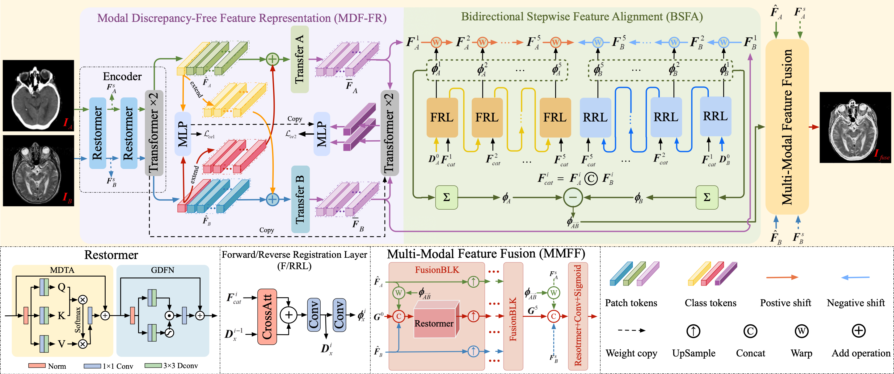

# BSAFusion
 If unaligned multimodal medical images can be simultane- ously aligned and fused using a single-stage approach within a unified processing framework, it will not only achieve mu- tual promotion of dual tasks but also help reduce the com- plexity of the model. However, the design of this model faces the challenge of incompatible requirements for feature fusion and alignment; specifically, feature alignment requires con- sistency among corresponding features, whereas feature fu- sion requires the features to be complementary to each other. To address this challenge, this paper proposes an unaligned medical image fusion method called Bidirectional Stepwise Feature Alignment and Fusion (BSFA-F) strategy. To reduce the negative impact of modality differences on cross-modal feature matching, we incorporate the Modal Discrepancy- Free Feature Representation (MDF-FR) method into BSFA- F. MDF-FR utilizes a Modality Feature Representation Head (MFRH) to integrate the global information of the input im- age. By injecting the information contained in MFRH of the current image into other modality images, it effectively re- duces the impact of modality differences on feature alignment while preserving the complementary information carried by different images. In terms of feature alignment, BSFA-F em- ploys a bidirectional stepwise alignment deformation field prediction strategy based on the path independence of vec- tor displacement between two points. This strategy solves the problem of large spans and inaccurate deformation field pre- diction in single-step alignment. Finally, Multi-Modal Fea- ture Fusion block achieves the fusion of aligned features. The experimental results across multiple datasets demonstrate the effectiveness of our method. 



## Main Reference Environment
1. Linux         (NVIDIA GeForce RTX 4090)
2. Python        (3.9.0)
3. torch         (2.1.0 + cuda12.1)
5. kornia        (0.7.0)
6. pandas        (2.1.1)
7. numpy         (1.24.3)
8. scipy         (1.11.3)
9. monai         (1.3.0)
10. cv2          (4.8.1)
11. PIL          (10.0.1)

## Usage


1. Data Preparation

    Download datasets form: http://www.med.harvard.edu/aanlib/

    All images are normalized to [0,1].


2. Train:

    make a csv file use your data
     ```
    python /data/make_csv.py
    ```
     ```
    python BSAFusion_train.py
    ```

3. Test:

    cat the pretraining weight first:
     ```
     cd checkpoint
    cat BSAFusion_CT* > BSAFusion_CT.pkl
    cat BSAFusion_PET* > BSAFusion_PET.pkl
    cat BSAFusion_SPECT* > BSAFusion_SPECT.pkl
    ```
    run test code:
     ```
    python BSAFusion_test.py
    ```
